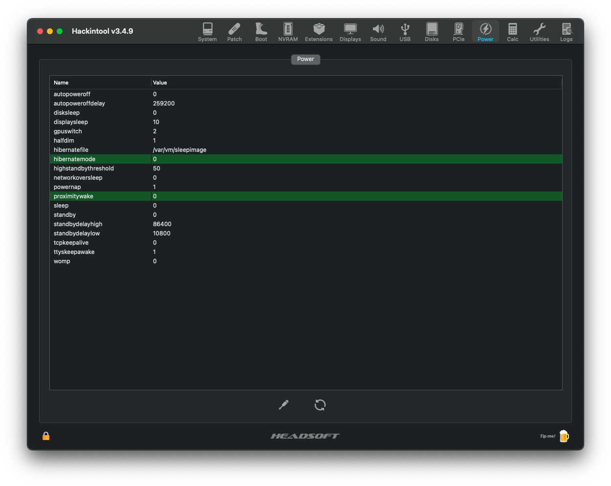

# Hackintosh-HP-EliteBook-840-G4
OpenCore EFI for the HP EliteBook 840 G4

# Overview:
This repository was built to make a fully working OpenCore EFI for this laptop. It's based on my work and help from other people.


## Laptop Specification:
- BIOS: For the highest stability use 1.29 (latest version works too, but need to remake SSDT-BATT for better battery management)
- CPU: Intel® Core i7-7600U (for other CPUs, you need to make CPUFriendDataProvider.kext [yourself](https://dortania.github.io/OpenCore-Post-Install/universal/pm.html#using-cpu-friend))
- GPU: Intel® HD Graphics 620
- RAM: 8GB DDR4 2133MHz
- Wi-Fi/BT: Apple AirPort BCM94360CS2 (if you're using the builtin Intel WiFi - inject [Itlwm](https://github.com/OpenIntelWireless/itlwm) and [IntelBluetoothFirmware](https://github.com/OpenIntelWireless/IntelBluetoothFirmware) kexts)
- Audio: Conexant CX8200
- ETH: Intel® Ethernet Connection I219-LM (I219-V also supported with IntelMausi)
- Display: 14" Full HD Touchscreen (for the non-touch model, remove everything regarding VoodooI2C, and use VoodooInput from VoodooRMI)
- Touchpad: Synaptics SMBus
- Keyboard: PS2 HP Keyboard
- Webcam: HP HD Camera (the camera may work out of the box, or not work at all - there is no way to fix it)
- SD Card Reader: Realtek

## BIOS Settings:
- Disable TPM Security
- Disable Physical Presence Interface
- Disable Intel SGX
- Enable System Management Command
- Disable Fast Boot
- Enable USB Storage Boot
- Disable Network PXE Boot
- Disable Power On when AC Detected
- Disable Power On when Lid is Opened
- Disable Secure Boot
- Disable Legacy Boot
- Enable Turbo Boost
- Enable Hyperthreading
- Enable Multi-Processor
- Enable VT-x
- Disable VT-d
- Disable Fast Charge
- Enable Turbo Boost on DC
- Disable HP Application Driver
- Enable LAN Controller
- Disable Wake on LAN
- Disable Lock Wireless Button
- Enable WLAN
- Enable Bluetooth
- Disable LAN/WLAN Auto Switching
- Enable Fan Always On while on AC Power
- Enable Fan Quietness Mode
- Enable Boost Converter
- Enable Touch Device
- Enable Integrated Camera
- Enable Media Card Reader
- Disable Smart Card
- Enable Runtime Power Management
- Disable Extended Idle Power States
- Disable Deep Sleep
- Disable Wake when Lid is Opened
- Disable Wake when AC is Detected
- Disable Wake on USB
- Enable Power Control

# Tweaks:

### ACPI
Here I explain what each SSDT in the EFI does.

| SSDT | What is it used for | Is it required |
| ------------- | ------------- | ------------- |
| SSDT-PLUG | Fixes CPU power management | Yes |
| SSDT-BATT | Fixes battery indicator and power management | Yes |
| SSDT-USBX | Fixes Embedded Controller | Yes |
| SSDT-GPRW | Fixes wake on USB or power state change | Yes |
| SSDT-ZPTS | Fixes auto reboot when shutting down | Yes |
| SSDT-HP-FixLidSleep | Fixes keyboard spam on lid close | Yes |
| SSDT-PWRB | Fixes power button | Yes |
| SSDT-HPET | Fixes IRQ conflicts | ? |
| SSDT-PNLF | Enables brightness controll | Yes |
| SSDT-XOSI | Fixes touchscreen and touchpad | Yes |
| SSDT-SBUS-MCHC | Improves SMBus support | ? |
| SSDT-PMCR | Some LPCB device fix | ? |
| SSDT-PPMC | Some real macOS device fix | ? |
| SSDT-SET-STAS | Fixes support for latest BIOS versions | Disable if on BIOS version lower than 1.32 |

### ACPI renames and patches
Here I explain what does each ACPI patch do.

| Patch | What is it used for | Is it required |
| ------------- | ------------- | ------------- |
| RTC Fix to stop Post Error | Fixes RTC wake | Yes |
| Rename EC0 to EC | Fixes Embedded Controller issue | Yes |
| Rename EC method BTIF to XTIF | Fixes Embedded Controller issue | Yes |
| Rename EC method BTST to XTST | Fixes Embedded Controller issue | Yes |
| Rename EC method ITLB to XTLB | Fixes Embedded Controller issue | Yes |
| Rename EC method GBTI to XBTI | Fixes Embedded Controller issue | Yes |
| Rename EC method GBTC to GBTX | Fixes Embedded Controller issue | Yes |
| Rename EC method SBTC to SBTX | Fixes Embedded Controller issue | Yes |
| Rename EC method GACW to XACW | Fixes Embedded Controller issue | Yes |
| Rename EC method GBAW to XBAW | Fixes Embedded Controller issue | Yes |
| Rename SB package NBTI to NBTX | Fixes Embedded Controller issue | Yes |
| Rename method GPRW to XPRW | Fixes wake on USB or power state change | Yes |
| \_CRS to XCRS | Fixes touchscreen and touchpad | Yes |
| Rename PWRB method \_STA to XSTA | Fixes power button | Yes |
| \_PTS to ZPTS | Fixes auto reboot when shutting down | Yes |
| HPET \_CRS to XCRS Rename | Fixes IRQ conflicts | ? |
| RTC IRQ 8 Patch | Fixes RTC IRQ conflict | ? |
| TIMR IRQ 0 Patch | Fixes TIMR IRQ conflict | ? |
| Rename \_OSI to XOSI | Fixes touchscreen and touchpad | Yes |
| ACPI Patch for latest BIOS | Fixes support for latest BIOS versions | Disable if on BIOS version lower than 1.32 |

### Kexts
Here I explain what each injected kext is used for.
| Kext | What is it used for | Is it required |
| ------------- | ------------- | ------------- |
| AppleALC | Fixes audio | Yes |
| CPUFriend | Fixes CPU power management | Yes |
| CPUFriendDataProvider | Provides information about the CPU for CPUFriend | You need to [make a custom CPUFriendDataProvider](https://dortania.github.io/OpenCore-Post-Install/universal/pm.html#using-cpu-friend)) if you have a different CPU |
| CtlnaAHCIPort | Fixes some AHCI controllers that were dropped in Big Sur | ? |
| IntelMausi | Fixes ethernet | Yes |
| Lilu | A kext to patch many processes, required for AppleALC, WhateverGreen, VirtualSMC and many other kexts. Without Lilu, they will not work | Yes |
| NVMeFix | Fixes power management and initialization on non-Apple NVMe | Yes |
| Sinetek-rtsx | Fixes SD card reader | Yes |
| VirtualSMC | Emulates the SMC chip found on real macs, without this macOS will not boot | Yes |
| SMCBatteryManager | Used for measuring battery readouts on laptops | Yes |
| SMCProcessor | Used for monitoring CPU temperature | Yes |
| SMCSuperIO | Used for monitoring fan speed | ? |
| USBPorts | USB ports map | You need to [make a custom USB map](https://dortania.github.io/OpenCore-Post-Install/usb/), you can also use Hackintool for that |
| VoodooI2C | Used for fixing I2C devices | Disable if no touchscreen |
| VoodooI2CHID | Satellite for VoodooI2C, fixes I2C touchscreen | Disable if no touchscreen |
| VoodooPS2Controller | Fixes PS2 keyboard | Yes |
| VoodooRMI | Fixes the touchpad | Yes |
| VoodooSMBus | Required for VoodooRMI to work with SMBus devices | Yes |
| WhateverGreen | Used for graphics patching DRM, boardID, framebuffer fixes, etc. | Yes |

If you use the builtin Intel Wi-Fi, inject [Itlwm](https://github.com/OpenIntelWireless/itlwm) and [IntelBluetoothFirmware](https://github.com/OpenIntelWireless/IntelBluetoothFirmware) kexts.

### CPU Power Management
The settings I used for CPUFriendFriend, for managing CPU power:
| Feature | Setting |
| ------------- | ------------- |
| LFM (Low Frequency Mode) | 800Mhz (recommended value from Intel ARK website) |
| EPP (Energy Performance Preference) | 0x3F (focused on performance, but with decent battery saving)|
| Performance Bias | 0x05 (focused on fair performance and high stability)|
| Additional Energy Savings Options | Yes |

### Configure sleep


These are the settings that work for me. Setting hibernatemode to 0 doesn't let me put the laptop into sleep mode, so I kept the default value.

To apply patches for sleep - type the following commands in the terminal:
```
sudo pmset autopoweroff 1
sudo pmset powernap 0
sudo pmset proximitywake 0
sudo pmset sleep 1
sudo pmset standby 1
```

### HiDPI Scaling (Retina Scaling)


Retina displays on real Apple devices have a high pixel density because of HiDPI scalling. One logical pixel is four physical pixels on Retina displays. This can be emulated on Hackintoshes too. I used a script called [one-key-hidpi](https://github.com/xzhih/one-key-hidpi) which works pretty good on this device. Since Full HD is quite hard to work on while using a 14" display, this is a really useful fix. However, using it will make the Apple boot logo large at 2nd boot stage, and I haven't found a way to fix that yet.

These are the options I used in the script:
| Feature | Setting |
| ------------- | ------------- |
| HiDPI | Enable HiDPI |
| Icon | MacBook Pro |
| Resolution | 1920x1080 |

**Note:** HiDPI only works on Full HD or higher

## Not working:
- DRM (isn't supported on iGPU only systems)
- Proper CFG Unlock (there isn't an option in the BIOS, and I didn't find any way to disable it)
- FingerPrint Scanner (currently there's no way to emulate an OEM fingerprint scanner under macOS)
- Trackpoint (works with VoodooPS2Mouse, but using that kext breaks the touchpad - still working on it)
- Boot chime
- External display on VGA
- Dot to disable touchpad (in the upper left corner of the touchpad, might be possible with VoodooPS2)
- WiFi Button (LED always orange, button does nothing, might be possible with a custom SSDT)

## Not tested:
- NFC module
- LTE module
- SC reader
- Dock station
- USB-C
- HP Sure View

# Acknowledgements

##### Thanks to:
- [acidanthera](https://github.com/acidanthera) for OpenCore and almost all the kexts and drivers
- [dortania](https://github.com/dortania) for an awesome OpenCore guide
- [corpnewt](https://github.com/corpnewt) for many useful tools
- [headkaze](https://github.com/headkaze) for Hackintool
- [xzhih](https://github.com/xzhih) for one-key-hidpi
- [alexandred](https://github.com/alexandred) for VoodooI2C
- [ben9923](https://github.com/ben9923) for helping me fix all touchscreen related issues
- [1Revenger1](https://github.com/1Revenger1) for VoodooRMI
- [cholonam](https://github.com/cholonam) and [sinetek](https://github.com/sinetek) for Sinetek-rtsx
- [RehabMan](https://github.com/RehabMan) for many laptop hotpatches
- [kreizlie](https://github.com/kreizlie) for modified hotpatches and BIOS settings
- everyone who helped me on Reddit, Discord and GitHub
